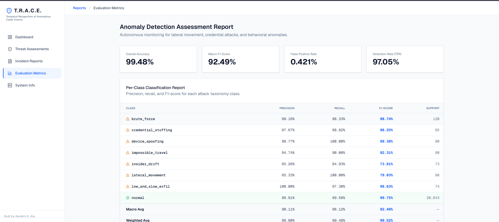

<div align="center">

# 🛡️ T.R.A.C.E.

### **Temporal Recognition of Anomalous Cyber Events**

### AI-Powered Behavioral Anomaly Detection Platform for Enterprise Security Operations Centers (SOC)

[]()
[]()
[]()
[]()
[]()
[]()
[]()

---

### Intelligent • Explainable • Real-Time • Enterprise Ready

An AI-driven cybersecurity platform that learns behavioral patterns, detects sophisticated attacks in milliseconds, classifies threat categories, and provides explainable security intelligence for Security Operations Centers.

</div>

---

# 📖 Overview

Traditional Security Information and Event Management (SIEM) systems depend heavily on static signatures and manually defined detection rules. While effective against known attacks, these approaches struggle to identify evolving threats such as insider attacks, credential compromise, lateral movement, and zero-day behavioral anomalies.

**T.R.A.C.E.** addresses this limitation by leveraging Artificial Intelligence to model normal user behavior over time. Instead of relying solely on predefined signatures, the platform continuously analyzes authentication events, detects deviations using temporal deep learning, classifies attack types, and explains every prediction using Explainable AI.

The system combines:

- Behavioral Analytics
- Deep Learning
- Machine Learning
- Explainable AI (XAI)
- Enterprise Dashboard
- Real-Time Threat Intelligence

into a unified enterprise-ready cybersecurity solution.

---

# 🚀 Key Features

## 🧠 Behavioral Anomaly Detection

Detects abnormal user activities without relying solely on predefined signatures.

---

## ⚡ Hybrid AI Engine

Combines

- LSTM Autoencoder
- XGBoost
- SHAP Explainability

to maximize both accuracy and interpretability.

---

## 🔍 Explainable AI

Every prediction is accompanied by SHAP feature attribution, allowing analysts to understand why an alert was generated.

---

## 📊 Enterprise Dashboard

Interactive SOC dashboard with

- Threat Monitoring
- Incident Reports
- Evaluation Metrics
- Explainable AI Reports

---

## ⚡ High Performance

- 99.48% Overall Accuracy
- 97.05% Detection Rate
- 0.421% False Positive Rate
- 2.58 ms Average Inference Latency

---

## 🔄 Modular Architecture

Independent modules for

- Data Generation
- Feature Engineering
- AI Engine
- REST API
- Frontend Dashboard

making future scaling straightforward.

---

# 🏗 System Architecture

<p align="center">


</p>

---

# 📷 Project Screenshots

## Dashboard

<p align="center">


</p>

---

## Evaluation Dashboard

<p align="center">



</p>

---

## Incident Analysis (Explainable AI)

<p align="center">


</p>

---

# 🎯 Problem Statement

Modern organizations generate millions of authentication events every day. Traditional rule-based detection systems often struggle to identify sophisticated behavioral attacks such as:

- Credential Stuffing
- Brute Force
- Insider Threats
- Impossible Travel
- Device Spoofing
- Lateral Movement
- Low-and-Slow Data Exfiltration

These attacks frequently bypass signature-based systems because they closely resemble legitimate user activity.

The primary challenges include:

- High false-positive rates
- Limited adaptability to evolving attack techniques
- Poor explainability of AI-driven alerts
- Delayed incident response
- Heavy dependence on manually maintained detection rules

---

# 💡 Our Solution

TRACE introduces an AI-powered behavioral analytics framework capable of learning normal user behavior over time.

The detection pipeline consists of four stages:

```
Enterprise Logs
        │
        ▼
Synthetic Data Generator
        │
        ▼
Behavioral Feature Engineering
        │
        ▼
LSTM Autoencoder
        │
        ▼
XGBoost Classifier
        │
        ▼
SHAP Explainability
        │
        ▼
Enterprise Dashboard
```

Instead of asking:

> **"Does this log match a known attack?"**

TRACE asks:

> **"Does this behavior resemble the user's normal activity?"**

This enables detection of previously unseen attacks while significantly reducing false positives.

---

# 🌟 Why TRACE?

| Traditional SIEM | TRACE |
|------------------|--------|
| Signature Based | Behavioral Learning |
| Manual Rules | AI-Driven Detection |
| Limited Explainability | SHAP Explainability |
| Static Detection | Adaptive Learning |
| High False Positives | Low False Positive Rate (0.421%) |
| Reactive Security | Proactive Threat Intelligence |

---

# 📈 Performance

| Metric | Value |
|---------|-------|
| Overall Accuracy | **99.48%** |
| Macro F1 Score | **92.49%** |
| Detection Rate (TPR) | **97.05%** |
| False Positive Rate | **0.421%** |
| Average Latency | **2.58 ms/event** |
| Supported Attack Categories | **7** |
| Synthetic Enterprise Logs | **15,000+** |
| Simulated Users | **400+** |

---

# 🛠 Technology Stack

## Backend

- FastAPI
- Python
- REST APIs

## Frontend

- Next.js
- React
- Tailwind CSS

## Machine Learning

- PyTorch
- XGBoost
- SHAP
- Scikit-learn

## Data Processing

- Pandas
- NumPy

## Deployment

- Docker (Planned)
- Apache Kafka (Future)

---

# 📂 Project Structure

```
TRACE-Cyber-SOC
│
├── assets/
│   ├── architecture-diagram.png
│   ├── dashboard-overview.png
│   ├── evaluation-dashboard.png
│   ├── incident-analysis-dashboard.png
│
├── backend/
│   └── api.py
│
├── data/
│   ├── synthetic_access_logs.csv
│   └── data_taxonomy_documentation.json
│
├── frontend/
│   ├── src/
│   ├── public/
│   ├── package.json
│   └── ...
│
├── models/
│   ├── anomaly_detector.pkl
│   ├── attack_classifier.pkl
│   ├── baseline_profiler.pkl
│   └── shap_explainer.pkl
│
├── src/
│   ├── data_generator.py
│   ├── feature_engine.py
│   ├── model_engine.py
│   └── test_pipeline.py
│
├── app.py
├── start_platform.bat
├── start_platform.sh
├── README.md
└── .gitignore
```

---

# ⚙ System Workflow

The TRACE detection pipeline consists of four major phases.

---

## Phase 1 — Synthetic Enterprise Data Generation

A realistic enterprise authentication environment is simulated.

Generated information includes:

- Login timestamps
- User identities
- Departments
- Geographic locations
- Device fingerprints
- IP addresses
- Authentication outcomes
- Resource access patterns

Supported attack simulations:

- Credential Stuffing
- Brute Force
- Device Spoofing
- Impossible Travel
- Insider Drift
- Lateral Movement
- Low-and-Slow Exfiltration

Dataset Size

- **15,000+ Authentication Events**
- **400+ Enterprise Users**

---

## Phase 2 — Behavioral Feature Engineering

Each authentication event is transformed into behavioral features.

Extracted features include:

- Failed Login Window
- Login Frequency
- Geo Velocity
- Resource Rarity
- Time Since Last Login
- Device Trust Score
- Sequential User Behavior

These features capture behavioral context rather than isolated events.

---

## Phase 3 — Hybrid AI Detection Engine

### LSTM Autoencoder

Learns normal behavioral sequences.

Outputs

- Reconstruction Error
- Behavioral Anomaly Score

---

### XGBoost Classifier

If an anomaly is detected, XGBoost predicts the attack category.

Supported attack labels:

- Normal
- Brute Force
- Credential Stuffing
- Device Spoofing
- Impossible Travel
- Insider Drift
- Lateral Movement
- Low-and-Slow Exfiltration

---

### SHAP Explainability

Every prediction is explained using SHAP values.

Example:

```
Entity: EMP0128

Prediction:
Credential Stuffing

Top Features

✔ Failed Login Count
✔ Geo Velocity
✔ Login Frequency
✔ Device Mismatch
✔ Resource Rarity
```

This enables analysts to understand *why* the model generated a specific alert.

---

## Phase 4 — Enterprise Dashboard

The frontend provides

- Live Threat Monitoring
- Security Overview
- Performance Metrics
- Threat Explorer
- Explainable AI Reports
- Incident Investigation

---

# 🚀 Getting Started

## Prerequisites

Install

- Python 3.10+
- Node.js 18+
- npm
- Git

---

# Clone Repository

```bash
git clone https://github.com/apratimjha/TRACE-Cyber-SOC.git

cd TRACE-Cyber-SOC
```

---

# Install Backend Dependencies

```bash
pip install -r requirements.txt
```

If requirements.txt is unavailable:

```bash
pip install fastapi uvicorn pandas numpy torch scikit-learn xgboost shap
```

---

# Install Frontend

```bash
cd frontend

npm install
```

---

# Run Backend

```bash
python app.py
```

or

```bash
uvicorn backend.api:app --reload
```

---

# Run Frontend

```bash
cd frontend

npm run dev
```

---

Open

```
http://localhost:3000
```

---

# Running the Complete Platform

Windows

```bash
start_platform.bat
```

Linux / macOS

```bash
chmod +x start_platform.sh

./start_platform.sh
```

---

# REST API

## Health Check

```
GET /health
```

---

## Predict Threat

```
POST /predict
```

Input

```json
{
    "entity_id":"EMP0105",
    "ip":"10.20.15.3",
    "country":"India",
    "device":"Windows",
    "failed_logins":4
}
```

Output

```json
{
    "prediction":"Credential Stuffing",
    "risk_score":96.8,
    "confidence":0.98
}
```

---

## Dashboard Data

```
GET /dashboard
```

Returns

- KPIs
- Threat Statistics
- Detection Metrics
- Incident Reports

---

# Experimental Evaluation

The proposed framework was evaluated using synthetic enterprise authentication logs.

Performance Metrics

| Metric | Result |
|----------|----------|
| Overall Accuracy | **99.48%** |
| Macro F1 Score | **92.49%** |
| Detection Rate | **97.05%** |
| False Positive Rate | **0.421%** |
| Avg Latency | **2.58 ms** |

---

# Attack Coverage

TRACE currently detects

| Attack | Supported |
|----------|-----------|
| Brute Force | ✅ |
| Credential Stuffing | ✅ |
| Device Spoofing | ✅ |
| Impossible Travel | ✅ |
| Insider Drift | ✅ |
| Lateral Movement | ✅ |
| Low-and-Slow Exfiltration | ✅ |

---

# Explainable AI

Unlike conventional anomaly detectors,

TRACE explains

- why an attack was detected
- which behavioral features contributed
- feature importance ranking
- prediction confidence

This makes the framework suitable for enterprise SOC analysts.

---

# Security Objectives

The project focuses on

✔ Early Threat Detection

✔ Low False Positives

✔ Explainable AI

✔ Fast Inference

✔ Enterprise Scalability

✔ Analyst Trust

✔ Modular Deployment

---

